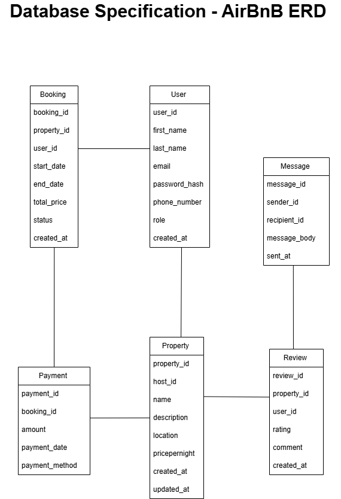

# Database Specification - AirBnB 
## Entities and Attributes: 

### **1. User** 
- The person using the app 
  - **user_id:** Primary Key, UUID, Indexed 
  - **first_name:** VARCHAR, NOT NULL 
  - **last_name:** VARCHAR, NOT NULL 
  - **email:** VARCHAR, UNIQUE, NOT NULL 
  - **password_hash:** VARCHAR, NOT NULL  
  - **phone_number:** VARCHAR, NULL 
  - **role:** ENUM (guest, host, admin), NOT NULL 
  - **created_at:** TIMESTAMP, DEFAULT CURRENT_TIMESTAMP 
    
### **2. Property** 
- A house or apartment listed for rent 
  - **property_id:** Primary Key, UUID, Indexed 
  - **host_id:** Foreign Key, references User(user_id) 
  - **name:** VARCHAR, NOT NULL 
  - **description:** TEXT, NOT NULL 
  - **location:** VARCHAR, NOT NULL 
  - **pricepernight:** DECIMAL, NOT NULL 
  - **created_at:** TIMESTAMP, DEFAULT CURRENT_TIMESTAMP 
  - **updated_at:** TIMESTAMP, ON UPDATE CURRENT_TIMESTAMP 
    
### **3. Booking** 
- A reservation made by a user to occupy a property 
  - **booking_id:** Primary Key, UUID, Indexed 
  - **property_id:** Foreign Key, references Property(property_id) 
  - **user_id:** Foreign Key, references User(user_id) 
  - **start_date:** DATE, NOT NULL 
  - **end_date:** DATE, NOT NULL 
  - **total_price:** DECIMAL, NOT NULL 
  - **status:** ENUM (pending, confirmed, canceled), NOT NULL 
  - **created_at:** TIMESTAMP, DEFAULT CURRENT_TIMESTAMP 
    
### **4. Payment** 
- Payment for a booking 
  - **payment_id:** Primary Key, UUID, Indexed 
  - **booking_id:** Foreign Key, references Booking(booking_id) 
  - **amount:** DECIMAL, NOT NULL 
  - **payment_date:** TIMESTAMP, DEFAULT CURRENT_TIMESTAMP 
  - **payment_method:** ENUM (credit_card, paypal, stripe), NOT NULL 
    
### **5. Review** 
- Feedback given by the user 
  - **review_id:** Primary Key, UUID, Indexed 
  - **property_id:** Foreign Key, references Property(property_id) 
  - **user_id:** Foreign Key, references User(user_id) 
  - **rating:** INTEGER, CHECK: rating >= 1 AND rating <= 5, NOT NULL 
  - **comment:** TEXT, NOT NULL 
  - **created_at:** TIMESTAMP, DEFAULT CURRENT_TIMESTAMP 
    
### **6. Message** 
- Customer feedback by the user 
  - **message_id:** Primary Key, UUID, Indexed 
  - **sender_id:** Foreign Key, references User(user_id) 
  - **recipient_id:** Foreign Key, references User(user_id) 
  - **messsage_body:** TEXT, NOT NULL 
  - **sent_at:** TIMESTAMP, DEFAULT CURRENT_TIMESTAMP 
    
## Relationships: 
- One **User** can own many **Properties.** 
- One **User** can make many **Bookings.** 
- One **Property** can have many **Bookings.** 
- One **Booking** has one **Payment.** 
- One **Booking** has one **Review.**
- One **Review** has one **Message.** 

## ER Diagram: 
 

