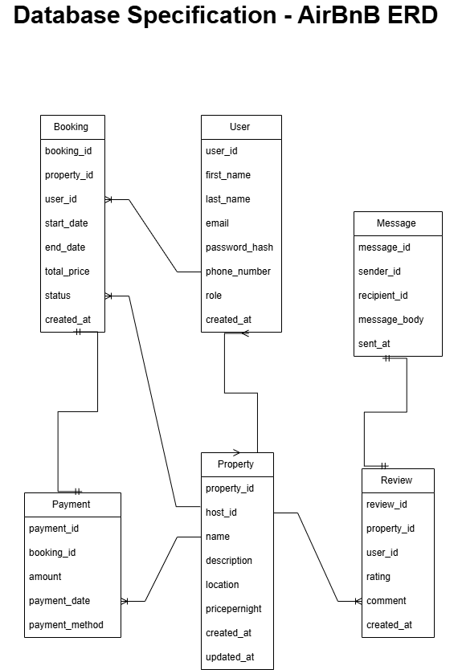

# Database Specification - AirBnB 
## Entities and Attributes: 

### **1. User** 
- **Attributes:** 
  - user_id 
  - first_name 
  - last_name 
  - email 
  - password_hash 
  - phone_number 
  - role 
  - created_at
    
### **2. Property** 
- **Attributes:** 
  - property_id 
  - host_id 
  - name 
  - description 
  - location 
  - pricepernight 
  - created_at 
  - updated_at
    
### **3. Booking** 
- **Attributes:** 
  - booking_id 
  - property_id 
  - user_id 
  - start_date 
  - end_date 
  - total_price 
  - status 
  - created_at
    
### **4. Payment** 
- **Attributes:** 
  - payment_id 
  - booking_id 
  - amount 
  - payment_date 
  - payment_method
    
### **5. Review** 
- **Attributes:** 
  - review_id 
  - property_id 
  - user_id
  - rating
  - comment
  - created_at
    
### **6. Message** 
- **Attributes:** 
  - message_id 
  - sender_id 
  - recipient_id
  - messsage_body
  - sent_at
    
## Relationships: 
- One **User** can own many **Properties.** 
- One **User** can make many **Bookings.** 
- One **Property** can have many **Bookings.** 
- One **Booking** has one **Payment.** 
- One **Booking** has one **Review.**
- One **Review** has one **Message.** 

## ER Diagram: 
 

