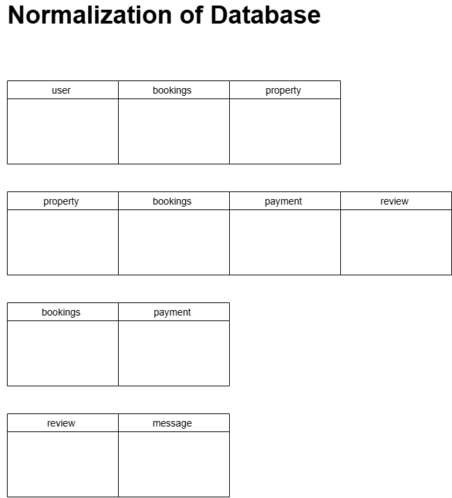

# Normalization of Data: 

## What is Data Normalization: 

## Normalization Diagram: 
 

## Relationships: 
- One **User** can own many **Properties.** 
- One **User** can make many **Bookings.** 
- One **Property** can have many **Users.** 
- One **Property** can have many **Bookings.** 
- One **Property** can have many **Payments.** 
- One **Property** can have many **Reviews.** 
- One **Booking** has one **Payment.** 
- One **Booking** has one **Review.** 
- One **Review** has one **Message.** 
